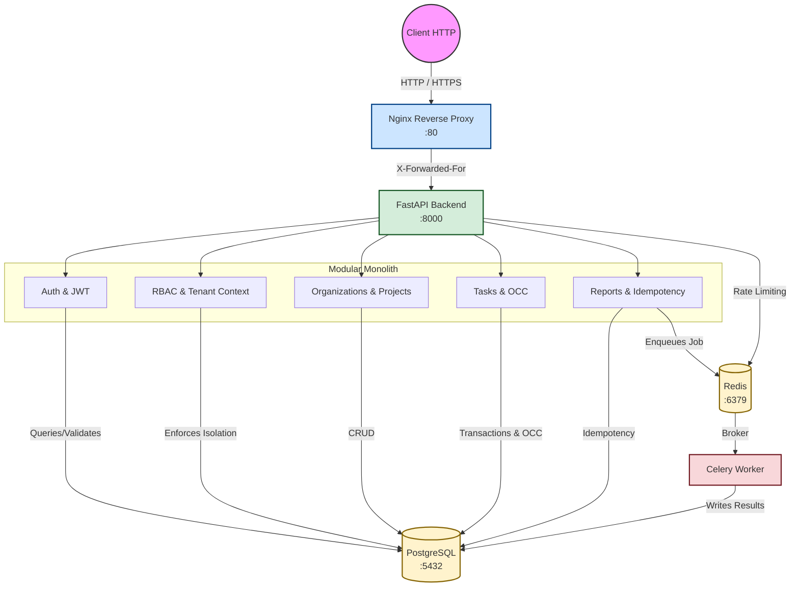

# Architecture

This document provides a comprehensive overview of the B2B SaaS modular monolith architecture.

## System Components

### 1. Nginx Reverse Proxy
Nginx serves as the single public-facing entry point to the system on Port 80. It shields the internal network topology from the internet, buffering requests and propagating standard forwarding headers (`X-Forwarded-For`, `X-Real-IP`). Authentication, RBAC, and business logic are specifically **excluded** from this layer and delegated to the backend.

### 2. FastAPI Backend
The core application is built with **FastAPI**. It follows a **Modular Monolith** architecture. Although deployed as a single containerized application, the code is cleanly separated into distinct feature domains (`organizations`, `projects`, `tasks`, `reports`). 

- **Dependency Injection**: FastAPI's dependency injection system is used to strictly enforce context extraction (e.g. `get_current_user`, `get_tenant_context`, `RoleChecker`).
- **Synchronous vs Asynchronous**: The API relies on synchronous SQLAlchemy 2.x via ThreadPoolExecutor mapping in FastAPI, ensuring stable integration with standard DB tools without the overhead of `asyncpg` where not needed.
- **Middleware**: A custom HTTP middleware automatically provisions an `X-Request-ID` for comprehensive structured logging trace propagation.

### 3. Authentication & Authorization
- **Authentication**: JWT (JSON Web Tokens) are generated upon successful login. Passwords are cryptographically hashed using `bcrypt` and `passlib`.
- **RBAC (Role-Based Access Control)**: Enforced via a custom `RoleChecker` dependency. Endpoint operations strictly require specific hierarchical roles (`OWNER`, `ADMIN`, `MEMBER`, `VIEWER`).

### 4. Tenant Isolation
Multi-tenancy is enforced at the application level (Row-Level Security was considered but bypassed in favor of explicit context boundaries).
- The `get_tenant_context` dependency ensures the authenticated user actively belongs to the requested `organization_id`.
- Every database query implicitly scopes results by the context `organization_id` to prevent cross-tenant data leakage.

### 5. PostgreSQL (Source of Truth)
PostgreSQL 15 serves as the single source of truth for the entire application.
- **Concurrency**: Optimistic Concurrency Control (OCC) is enforced using a `version` column on high-contention entities like `Task`. Concurrent updates throw a `409 Conflict`, requiring the client to retry.
- **Idempotency**: Implemented for expensive operations (e.g., Report Generation). The `idempotency_key` is uniquely constrained per tenant, preventing duplicate background jobs or duplicated resource creation.

### 6. Redis (Caching & Rate Limiting)
Redis serves two primary roles:
1. **Rate Limiting**: Sliding window rate limits are enforced via dependency injection, keyed by `rate_limit:{ip}`.
2. **Celery Broker**: Acts as the message broker passing background task signatures from FastAPI to Celery.

### 7. Celery Background Jobs
Long-running jobs (like generating organization-wide reports) are deferred to a Celery worker.
- The worker executes synchronously but isolated from the web request cycle.
- **State Storage**: The application explicitly avoids using a Celery Result Backend. The PostgreSQL database remains the source of truth for task execution status. The worker directly updates the `OrganizationReport` row in PostgreSQL upon completion.

## Request Flow
1. **Client** issues an HTTP Request.
2. **Nginx** forwards it to **FastAPI** (`backend:8000`).
3. **Middleware** assigns an `X-Request-ID`.
4. **FastAPI Router** executes dependencies:
   - Evaluates `RateLimit`.
   - Validates the JWT.
   - Extracts `Tenant Context` and verifies `RBAC` role.
5. **Business Logic** executes. If it involves a long-running report, it queues a message in **Redis**.
6. **Celery Worker** picks up the message and processes the background task independently, updating **PostgreSQL**.
7. **FastAPI** responds to the user synchronously.
