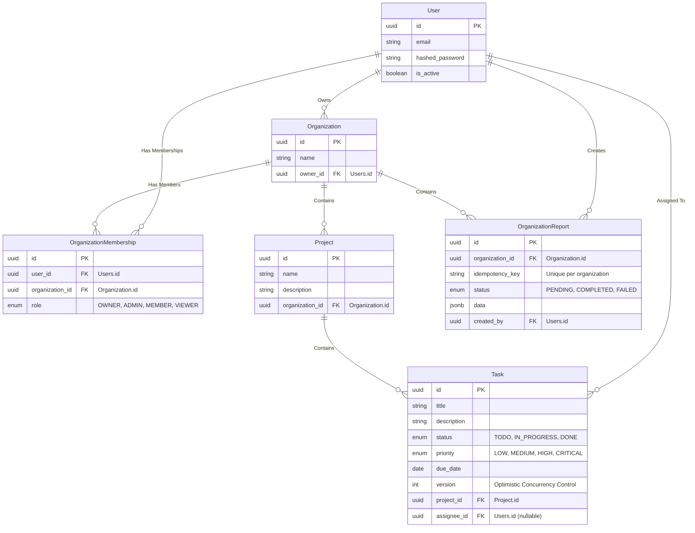

# Database Architecture

This document outlines the PostgreSQL 15 database schema for the B2B SaaS application. It uses SQLAlchemy 2.x ORM with Alembic for migrations.

## Core Models

### 1. `users`
The core identity table for authentication.
- **Columns**: `id` (UUID), `email` (String, Unique), `hashed_password` (String), `is_active` (Boolean).
- **Constraints**: `email` is indexed and unique.

### 2. `organizations`
Represents a tenant in the multi-tenant architecture.
- **Columns**: `id` (UUID), `name` (String), `owner_id` (UUID, FK -> `users.id`).
- **Constraints**: `name` is indexed for fast lookup.

### 3. `organization_memberships`
Provides Role-Based Access Control (RBAC) linking users to tenants.
- **Columns**: `id` (UUID), `user_id` (UUID, FK -> `users.id`), `organization_id` (UUID, FK -> `organizations.id`), `role` (Enum: `OWNER`, `ADMIN`, `MEMBER`, `VIEWER`).
- **Constraints**: Unique constraint on `(user_id, organization_id)` prevents duplicate memberships. 

## Business Models

### 4. `projects`
Logical groupings of tasks within an organization.
- **Columns**: `id` (UUID), `name` (String), `description` (Text), `organization_id` (UUID, FK -> `organizations.id`).
- **Relationships**: A project strictly belongs to one organization.

### 5. `tasks`
The core unit of work, subject to high concurrency.
- **Columns**: 
  - `id` (UUID)
  - `title` (String), `description` (Text)
  - `status` (Enum: `TODO`, `IN_PROGRESS`, `DONE`)
  - `priority` (Enum: `LOW`, `MEDIUM`, `HIGH`, `CRITICAL`)
  - `due_date` (DateTime)
  - `project_id` (UUID, FK -> `projects.id`)
  - `assignee_id` (UUID, FK -> `users.id`, nullable)
  - `version` (Integer) - **Optimistic Concurrency Control (OCC)** column.
- **Indexes**: 
  - Composite Index on `(project_id, status)` for rapid filtering.
  - Index on `assignee_id`.

### 6. `organization_reports`
Tracks asynchronous, long-running jobs executed by Celery.
- **Columns**: 
  - `id` (UUID)
  - `organization_id` (UUID, FK -> `organizations.id`)
  - `status` (Enum: `PENDING`, `COMPLETED`, `FAILED`)
  - `data` (JSONB) - Stores the final computed report output.
  - `idempotency_key` (String)
  - `created_by_id` (UUID, FK -> `users.id`)
- **Constraints**: 
  - Unique constraint on `(organization_id, idempotency_key)` to enforce **Idempotency** at the database layer. This ensures identical rapid requests do not queue duplicate expensive Celery tasks.

## Key Database Behaviors

- **ON DELETE CASCADE**: Important relationships (e.g., deleting an Organization deletes all its Projects and Memberships) are explicitly configured to cascade, ensuring no orphaned data remains and enforcing strict tenant boundaries.
- **Row-Level Tenancy**: Every business model (`projects`, `organization_reports`) has an `organization_id` column explicitly checked in the application layer via `get_tenant_context()`. `tasks` are secured implicitly through their parent `project_id`.
- **JSONB Storage**: The `organization_reports.data` column leverages Postgres's native JSONB format to flexibly store varying schemas of analytical reports without requiring database migrations.
